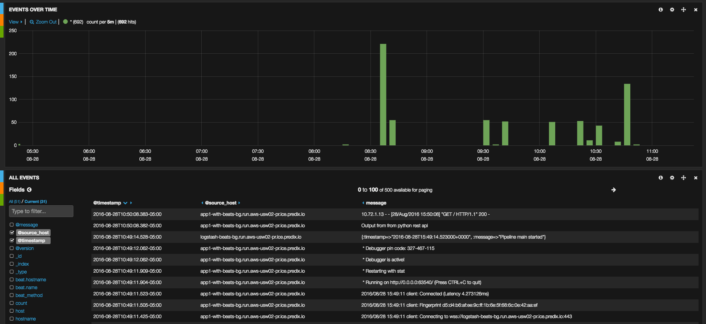
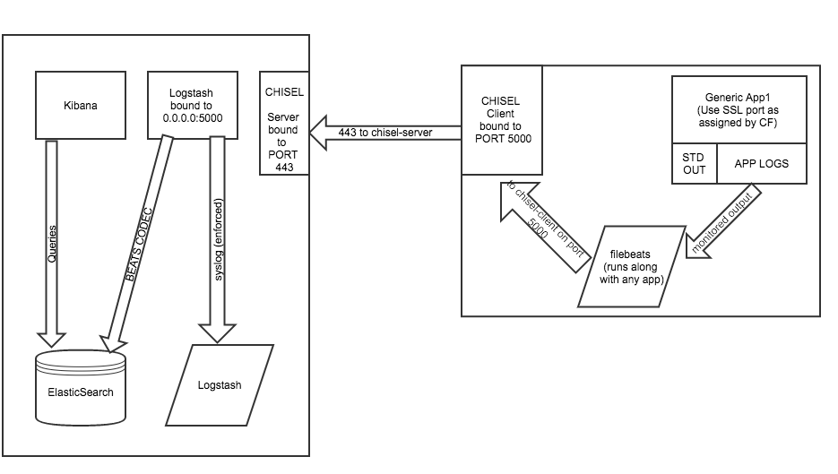

## Using filebeat with Predix Logstash (ELK Stack)

By default Predix provides logstash "syslog" output for "bound" applications.
The default logstash input filter makes finding your logs for multiple applications difficult, plus multi-line formatting becomes a problem.

This setup leverages "chisel" and "filebeat" to proxy your logs from any "unbound" application to a Predix logstash-wrapped instance.

Here's a screenshot of Kibana with multiple applications sending logs over filebeat/chisel into Predix:

### Architecture

The following diagram shows the entire setup, leveraging logstash, filebeat, and chisel.

### Wrapping logstash + filebeat

The key to this is creating a new CF application that runs "logstash" with the "beat" input plugin, sending data directly to ElasticSearch.  This application needs to be bound to your Predix logstash service.

To expose the new input to the "outside" a "chisel" server is bound to the application port (443), and will proxy to the local logstash executable, which then sends data directly to ElasticSearch.

### Example App

The directory "app1-with-beats" contains a small python flask-based REST API that uses filebeat+chisel to talk to the Predix logstash service via the wrapper explained above.

## TODO

* parameterize setup
* use CF environment variables to minimize parameters/hardcoding
